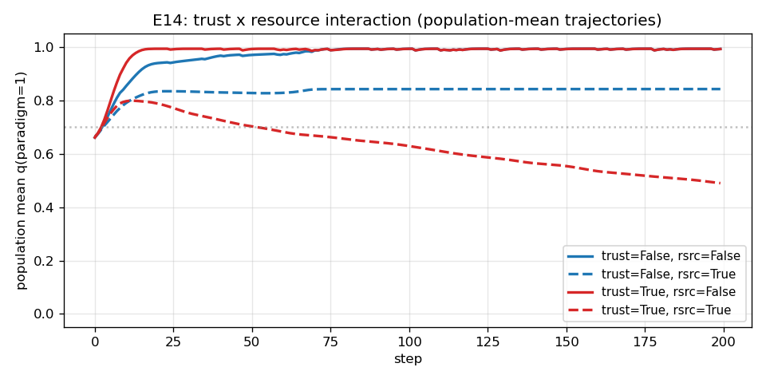
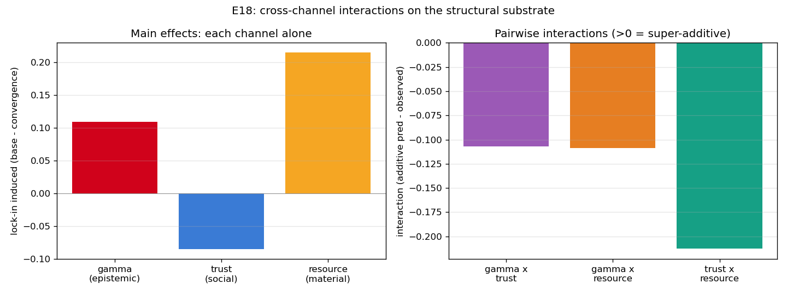
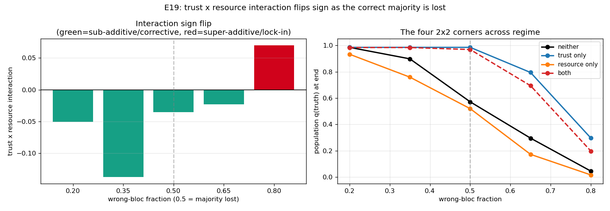
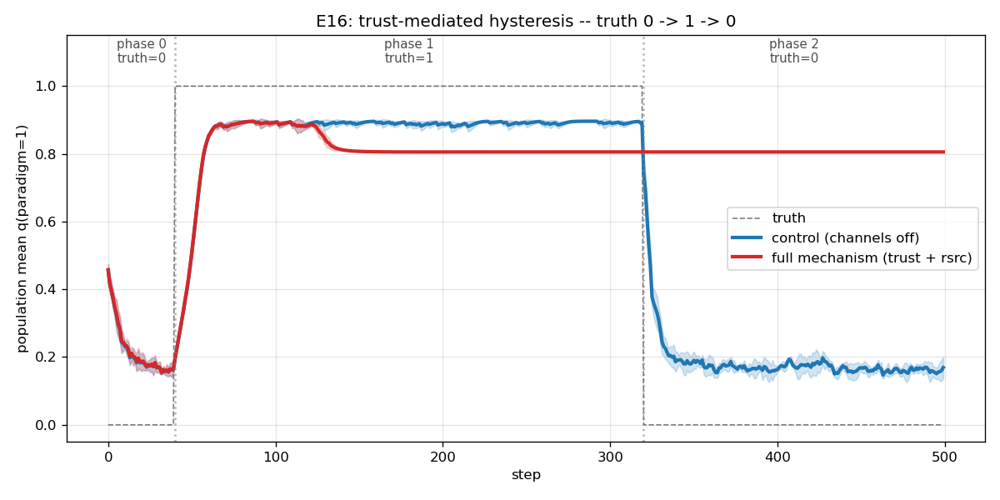
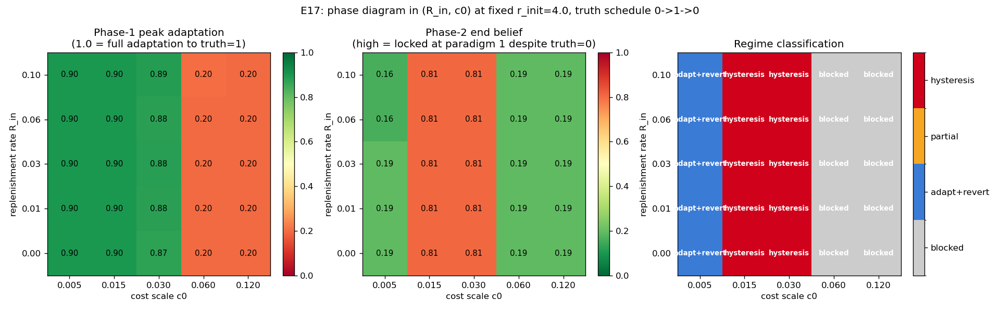
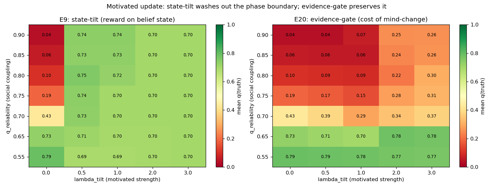

# One Currency, Two Channels

**Precision Collapse and the Conditions for Paradigm Lock-In in Multi-Agent Active Inference**

Mahault Albarracin · working draft, June 2026

This folder holds the standalone follow-up paper to the IWAI 2026 structural-BMR
work. The LaTeX source is [`main.tex`](main.tex); the bibliography is
[`refs.bib`](refs.bib). This README is a readable rendering so the argument and
figures can be read without compiling. To build the PDF, see
[Building](#building) at the bottom, or drop the folder into Overleaf.

---

## Abstract

Scientific communities sometimes hold an outdated paradigm long after the
evidence against it has arrived. I model this as the collapse of effective
precision on disconfirming evidence, and I ask which mechanisms can produce that
collapse in a population of active-inference agents who share a world. Three
candidate mechanisms are studied on a common substrate: conviction that
attenuates an agent's own observations, material resource limits that price
informative experiments out of reach, and learned trust that reweights
neighbours' reports. The mechanisms act on a single quantity, the precision that
gates belief updating, but they do not act on the same channel. Conviction and
resources both close the agent's *world* channel, its own observations, while
trust governs the *social* channel, what it hears from others. Lock-in needs
both channels closed at once. Trust on its own does not lock a community in: it
reallocates precision across sources by predictive accuracy, so it pulls a
misled minority toward the truth whenever some agents can still track the world,
and it amplifies error only once the world channel has already been starved.
This makes the interaction between trust and resources change sign with regime,
sub-additive while a reliable signal survives and super-additive once it is
gone. I map the boundary as a function of how many truth-tracking agents remain,
and I show the material channel reproduces hysteresis, the signature of path
dependence from the economics of increasing returns.

---

## The three claims

**Precision is the common currency, and lock-in is a two-channel condition.**
Conviction, resources, and trust each modulate the precision on disconfirming
evidence. Conviction and resources close the world channel; trust governs the
social channel. A community locks in only when both are shut.

**Trust corrects more often than it traps.** Trust follows predictive accuracy,
not headcount, so it follows whoever tracks the world. It rescues a misled
minority while accurate agents survive and amplifies error only after starvation
removes them. So the trust-by-resource interaction flips sign with regime.

**The material channel is path dependence.** The cost barrier on informative
experiments is an increasing-returns switching cost (Arthur; David). It produces
hysteresis: a population adapts to a new paradigm, spends its budget, and then
fails to revert when the truth reverses.

---

## Key results

### Trust + resources: super-additive regression from truth (E14)

Wrong-bloc final belief in the truth on the trust-by-resource grid. Additivity
predicts 0.69 for the both-on cell; the observed 0.38 is an interaction of +0.31.

|            | resources off | resources on |
|------------|:-------------:|:------------:|
| trust off  | 0.994         | 0.690        |
| trust on   | 0.994         | **0.381**    |

With both channels on, the population climbs toward truth, peaks near step 15,
then regresses to indecision. No single-channel condition does this.

### Cross-channel: the negative result that fixed the thesis (E18)

A 2×2×2 factorial over conviction (γ), trust, and resources. All three pairwise
interactions are sub-additive, and trust's main effect is *corrective* (it
raises wrong-bloc convergence from 0.90 to 0.985). Once trust is on, the wrong
bloc converges regardless of γ or resources.

This forced the two-channel reading: a wrong-bloc agent gets disconfirming
evidence from the world (its own observations) and from society (its
neighbours). γ and resources close the world route; trust governs the social
route. E18 only ever shuts one, so trust rescues the bloc. Lock-in needs both.

### The sign flip, mapped (E19)

Sweeping the misled fraction with γ off, the trust-by-resource interaction is
sub-additive while a correct majority survives and turns super-additive once the
wrong bloc dominates. Zero crossing between 0.65 and 0.80.

| wrong fraction | 0.20 | 0.35 | 0.50 | 0.65 | 0.80 |
|----------------|:----:|:----:|:----:|:----:|:----:|
| interaction    | −0.051 | −0.137 | −0.035 | −0.023 | **+0.070** |

Trust-only is the highest curve at every fraction. It stays corrective even when
80% of agents hold the wrong paradigm, because it routes precision by accuracy
and accuracy tracks the world. It fails only when starvation removes the
truth-trackers' accuracy advantage, which is the super-additive corner.

### Material lock-in is path dependence, with hysteresis (E16, E17)

The cost barrier is an increasing-returns switching cost. A population adapts in
phase 1, drains its budget, and cannot afford to revert in phase 2 even though
phase 2 returns it to the truth it started from.

The phase diagram over inflow and cost scale shows three regimes
(adapt-and-revert, hysteresis, blocked); hysteresis is a band, not a point.

### The motivated update as a cost of mind-change (E20)

The original rule put a reward on the belief state and saturated, washing out
the social-coupling boundary. The corrected rule gates disconfirming movement
(a cost on change, per Hyland & Albarracin 2025) and the boundary survives.

---

## Status

The empirical core is essentially complete (~250 seeded runs across the
substrates). The remaining work is writing polish and three de-risking steps:
the 2D sign-flip surface (misled fraction × cost scale), K > 2 paradigms, and a
scan-and-vectorize refactor for referee-scale sweeps. Target venue AAAI 2027,
AAMAS as fallback.

The affiliation line in `main.tex` is a placeholder; set it before submission.

## Citation verification log

Every reference in `refs.bib` was checked against an authoritative source before
inclusion. Two reported attributions were corrected during verification:

| Key | Verified against | Note |
|-----|------------------|------|
| `arthur1994IncreasingReturns` | press.umich.edu | Univ. of Michigan Press, 1994 ✓ |
| `david1985QWERTY` | JSTOR 1805621 / RePEc | AER 75(2):332–337, 1985 ✓ (no DOI; P&P issue) |
| `liederGriffiths2020ResourceRational` | Cambridge Core | BBS 43:e1 (corrected from e19) |
| `zollman2010TransientDiversity` | Springer | Erkenntnis 72(1):17–35 ✓ |
| `oconnorWeatherall2019Misinformation` | PhilPapers | Yale UP, 2019 ✓ |
| `friston2024Ecosystems` | SAGE | Collective Intelligence 3(1); Albarracin is co-author ✓ |
| `friston2023Federated` | Elsevier / PubMed | Neurosci. Biobehav. Rev. 156:105500 ✓ |
| `catal2024BeliefSharing` | arXiv:2407.02465 | **Catal** et al. (not Heins, as first reported) |
| `heins2024CollectiveBehavior` | PNAS | 121(17):e2320239121 ✓ |
| `waade2025AsOneAndMany` | MDPI | Entropy 27(2):143; **Waade** et al. (not Tschantz/Da Costa) |
| `albarracin2022EpistemicCommunities`, `hylandAlbarracin2025MindChange`, `kuhn1962Structure`, `friston2015...`, `feldmanFriston2010...`, `parrFriston2019...`, `millidge2021EFE`, `wattsStrogatz1998...` | reused from vetted IWAI `refs.bib` | DOIs/arXiv on file |

## Building

No LaTeX install is assumed locally. Options:

- **Overleaf:** upload this folder, set `main.tex` as the root document, compile.
- **Local:** `pdflatex main && bibtex main && pdflatex main && pdflatex main`
- **CI:** [`ci/build-paper.yml`](ci/build-paper.yml) is a ready GitHub Actions
  workflow that compiles the PDF and uploads it as an artifact. Move it to
  `.github/workflows/` and push with a token that has `workflow` scope to enable
  it (it was kept out of `.github/` here to avoid that scope requirement).
